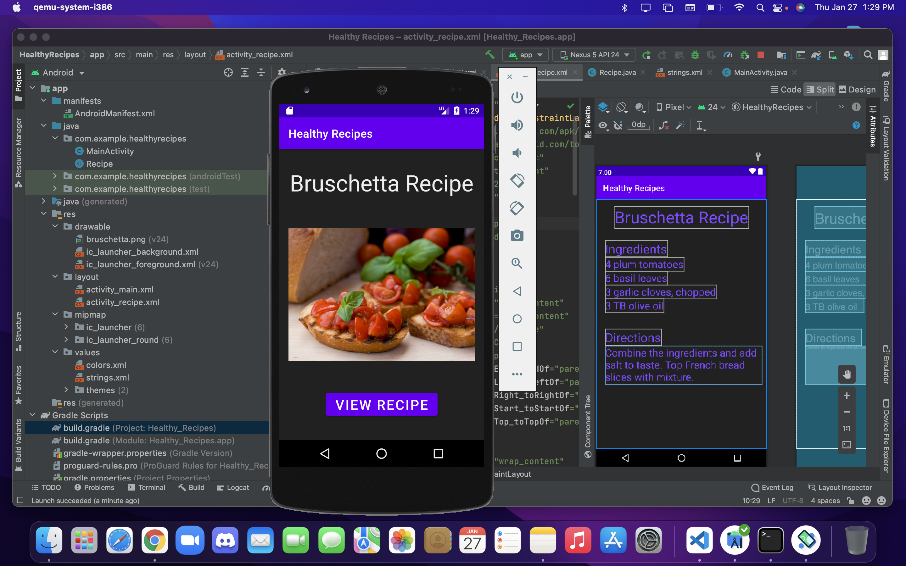
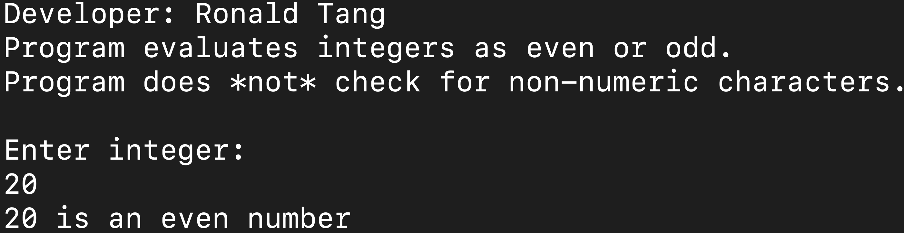

> **NOTE:** This README.md file should be placed at the **root of each of your repos directories.**
>
>Also, this file **must** use Markdown syntax, and provide project documentation as per below--otherwise, points **will** be deducted.
>

# LIS 4381 - Mobile Web Application Development

## Ronald Tang

### Assignment 2 Requirements:

*Sub-Heading:*

1. Created Healthy Recipe App
2. Screenshots of it running
3. Screenshot of Skillset 1
4. Screenshot of Skillset 2
5. Screenshot of Skillset 3

#### README.md file should include the following items:

* Screenshot of running applications first user interface
* Screenshot of running applications second user interface
* Bitbucket repo link

#### Assignment Screenshots:

*Screenshot of First User Interface running*:

*Screenshot of Second User Interface running*:

*Screenshot of Skillsets running running*:
  

#### Bitbucket Links:

*Bitbucket Tutorial - Station Locations:*
[A1 Bitbucket Station Locations Tutorial Link](https://bitbucket.org/username/bitbucketstationlocations/ "Bitbucket Station Locations")

*Remote repository:*
[My Remote Repository](https://bitbucket.org/ronaldtang1/lis4381/ "My Remote Repository")
