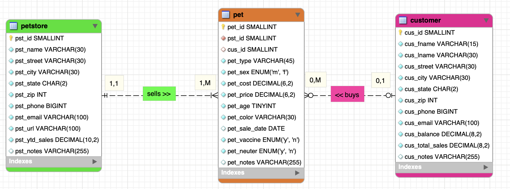
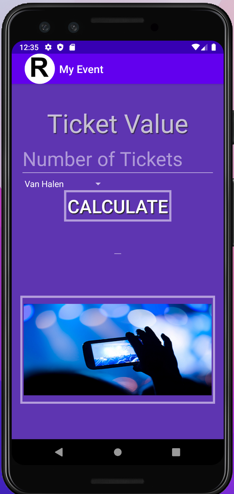
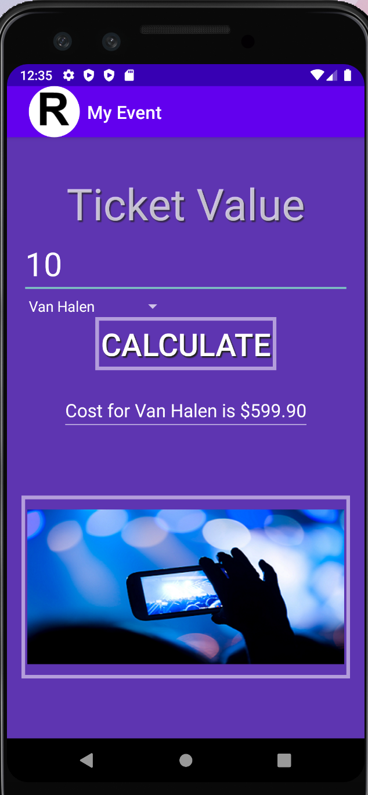
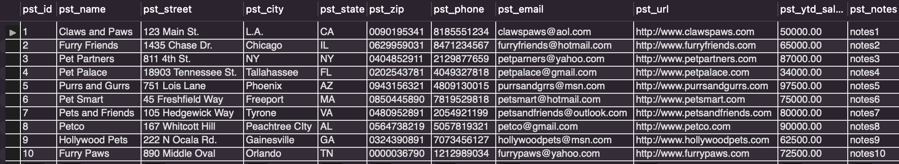
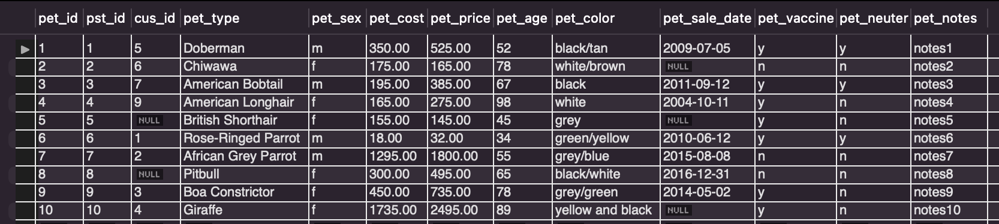
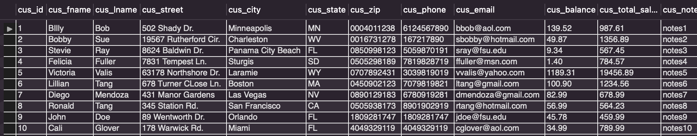
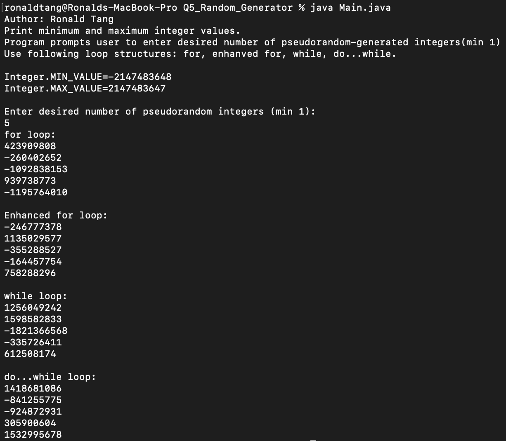
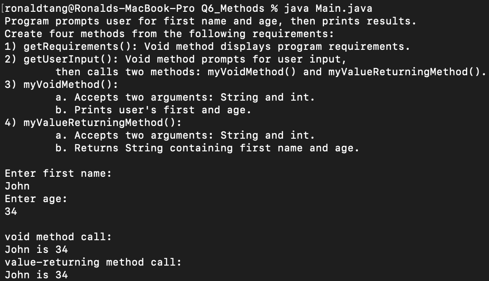

# LIS 4381 - Mobile Web Application Development

## Ronald Tang

### Assignment 3 Requirements:

*Five Parts:*

1. Created ERD 
2. Screenshots of running application's opening user interface
3. Screenshots of running application's processing user input
4. Screenshots of 10 records for each table 
5. Screenshots of skillsets

#### README.md file should include the following items:

* Screenshots of running application's opening user interface
* Screenshots of running application's processing user input
* Screenshots of skillsets
* Bitbucket repo link

#### Assignment Screenshots:

*Screenshot of ERD*

| Screenshot of running opening user interface | Screenshot of running user input |
| ---------- | ---------- |
|  |  |

*Screenshot of Petstore table*

*Screenshot of Pet table*

*Screenshot of Customer table*

| Skillset 4 | Skillset 5 | Skillset 6 |
| ---------- | ---------- | ----------|
|  |  | 

*Link to a3.mwb*
[a3.mwb](docs/a3.mwb)

*Link to a3.sql*
[a3.sql](docs/a3.sql)

#### Bitbucket Links:

*Remote repository:*
[My Remote Repository](https://bitbucket.org/ronaldtang1/lis4381/ "My Remote Repository")
