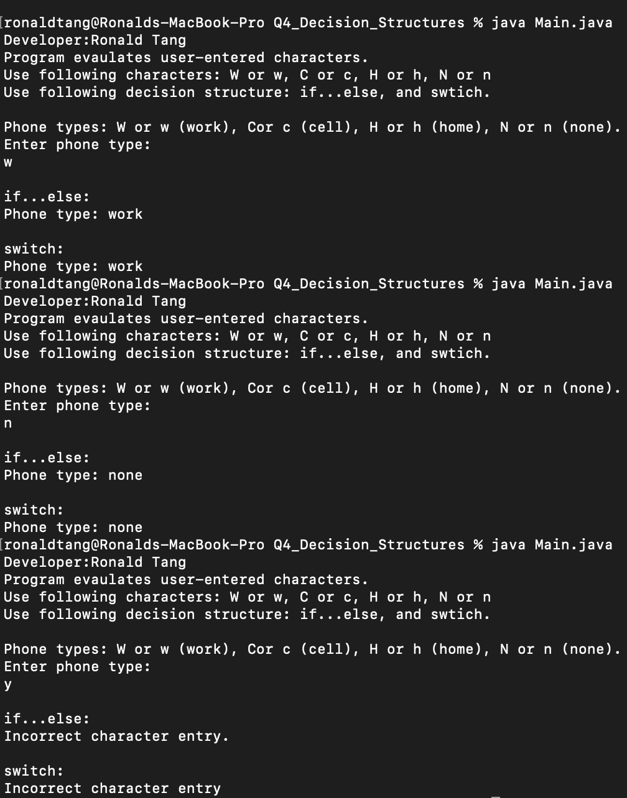

> **NOTE:** This README.md file should be placed at the **root of each of your repos directories.**
>
>Also, this file **must** use Markdown syntax, and provide project documentation as per below--otherwise, points **will** be deducted.
>

# LIS 4381 - Mobile Web Application Development

## Ronald Tang

### Assignment 3 Requirements:

*Sub-Heading:*

1. Created ERD 
2. Screenshots of running application's opening user interface
3. Screenshots of running application's processing user input
4. Screenshots of 10 records for each table 
5. Screenshots of skillsets

#### README.md file should include the following items:

* Screenshots of running application's opening user interface
* Screenshots of running application's processing user input
* Screenshots of skillsets
* Bitbucket repo link

#### Assignment Screenshots:

*Screenshot of ERD*

| Screenshot of running opening user interface | Screenshot of running user input |
| ---------- | ---------- |
|  |  |

| Petstore Table | Pet Table | Customer Table |
| ---------- | ---------- | ----------|
|  |  | 

| Skillset 4 | Skillset 5 | Skillset 6 |
| ---------- | ---------- | ----------|
|  |  | 

#### Bitbucket Links:

*Remote repository:*
[My Remote Repository](https://bitbucket.org/ronaldtang1/lis4381/ "My Remote Repository")
