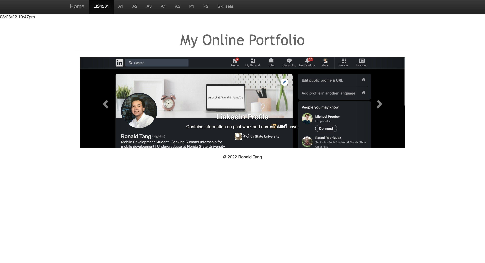
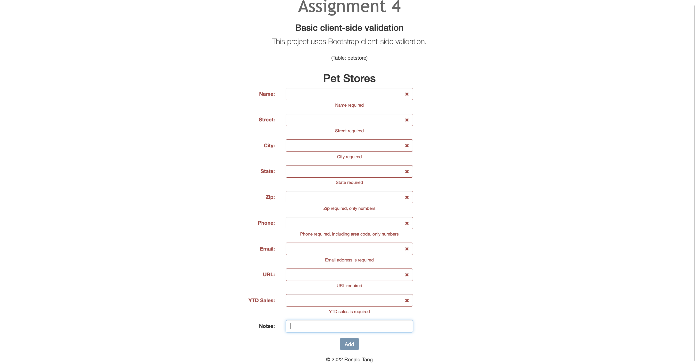
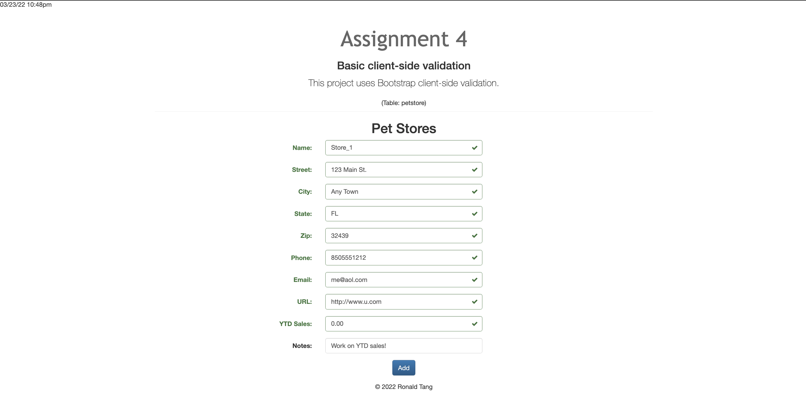
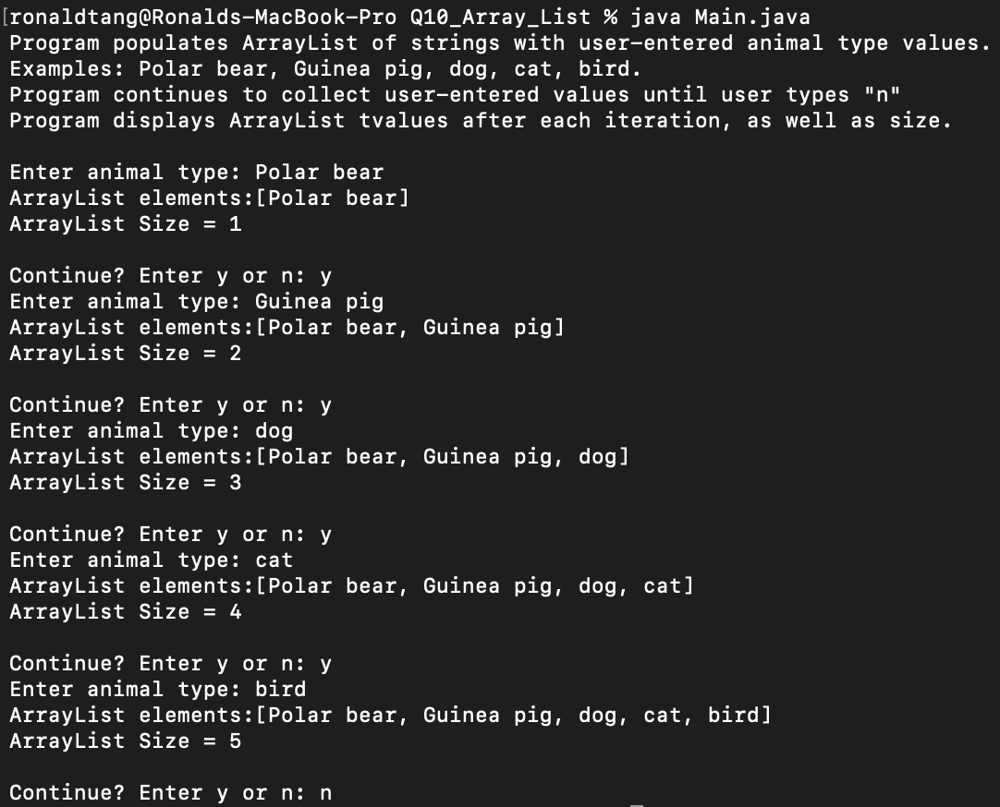
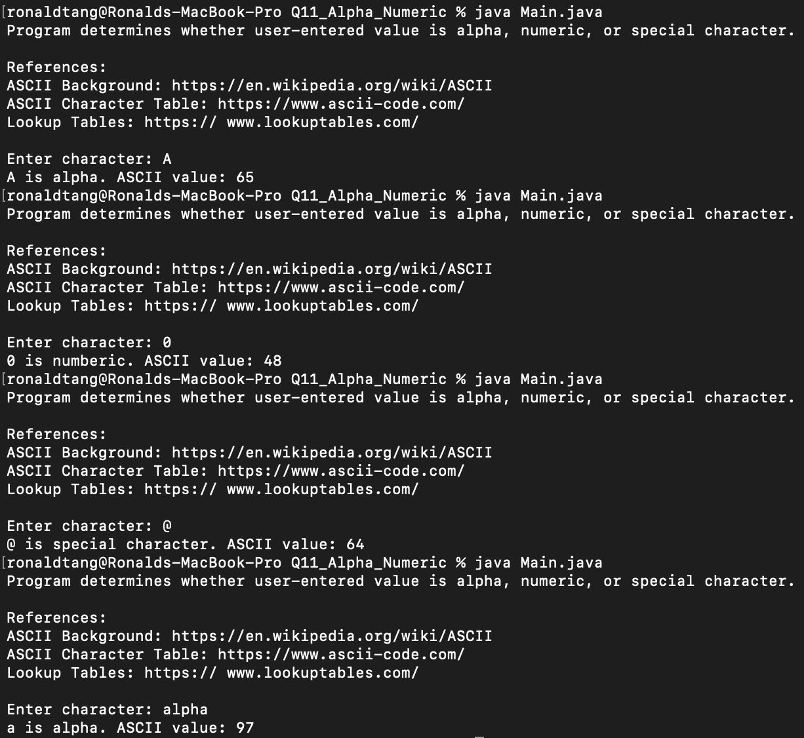

# LIS 4381

## Ronald Tang

### Assignment 4 # Requirements:

*Three Parts:*

1. Create an online portfolio web app
2. Make sure all links are functional
3. Provide screenshots of online portfolio

#### README.md file should include the following items:

* Screenshots of online portfolio main page
* Screenshots of failed validation
* Screenshots of passed validation
* Screenshots of skillsets 

#### Online Portfolio
*Link to local lis4381 web app*
[Online Portfolio](http://localhost:8080/repos/lis4381/index.php "Online Portfolio")

#### Assignment Screenshots:

*Screenshot of online portfolio main page:

*Screenshot of failed validation*:

*Screenshot of passed validation*:

| Skillset 10 | Skillset 11 | Skillset 12 |
| ---------- | ---------- | ----------|
|  |  | 

#### Bitbucket Link:

*My Remote repository:*
[Remote repository](https://bitbucket.org/ronaldtang1/lis4381/ "Remote repository")
