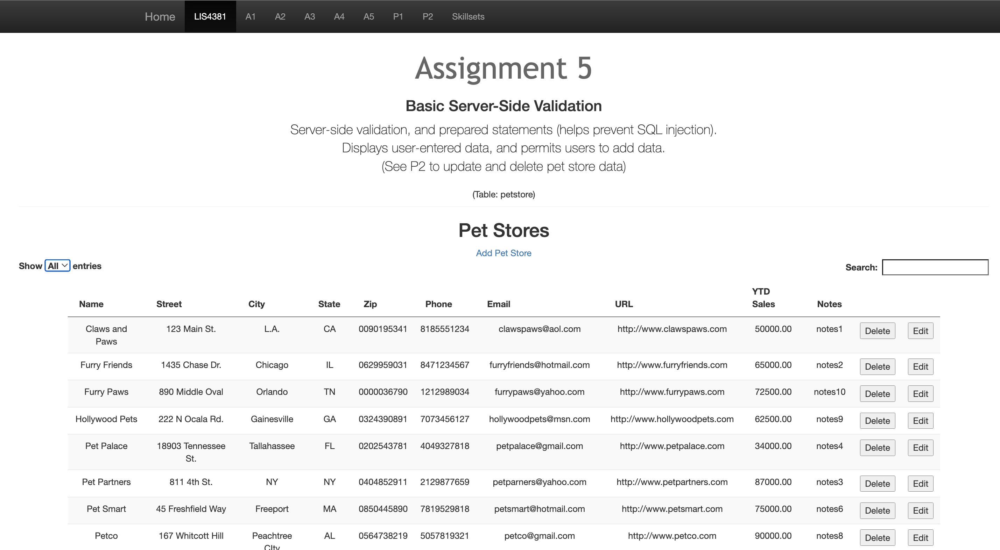
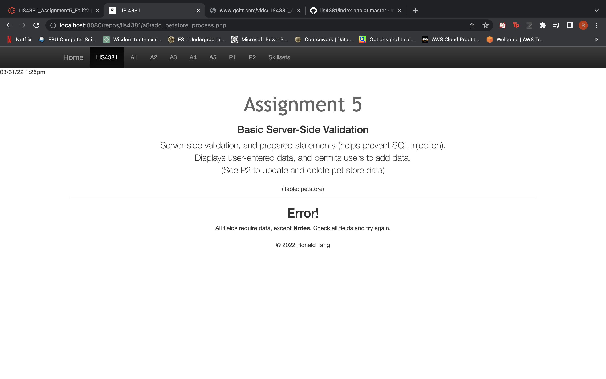
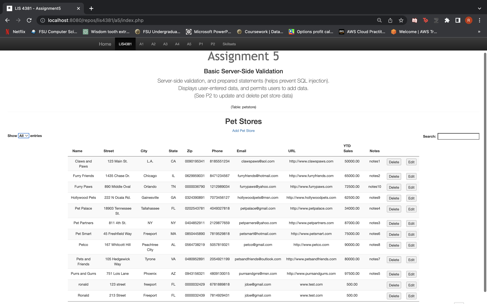
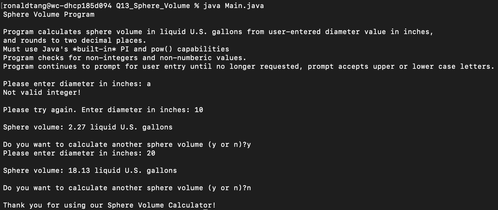
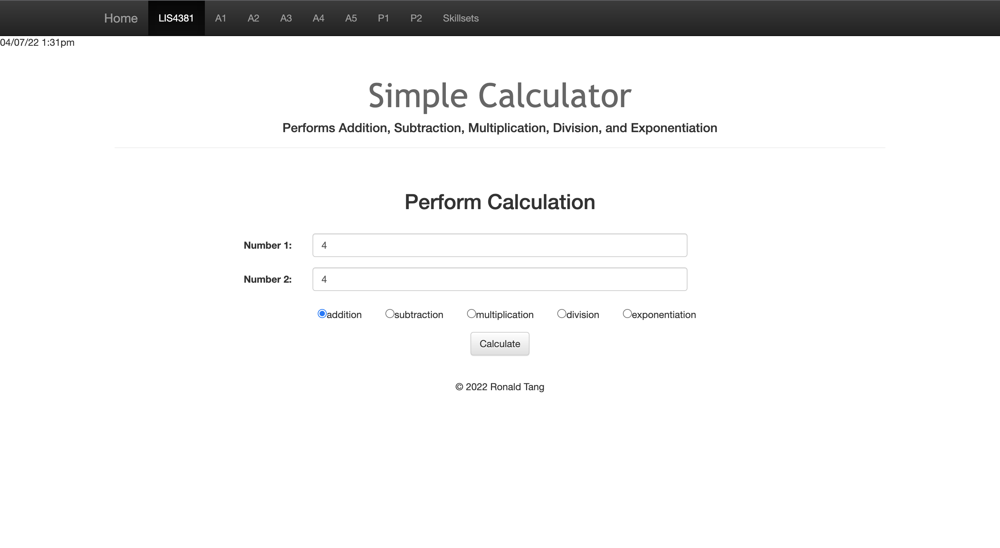
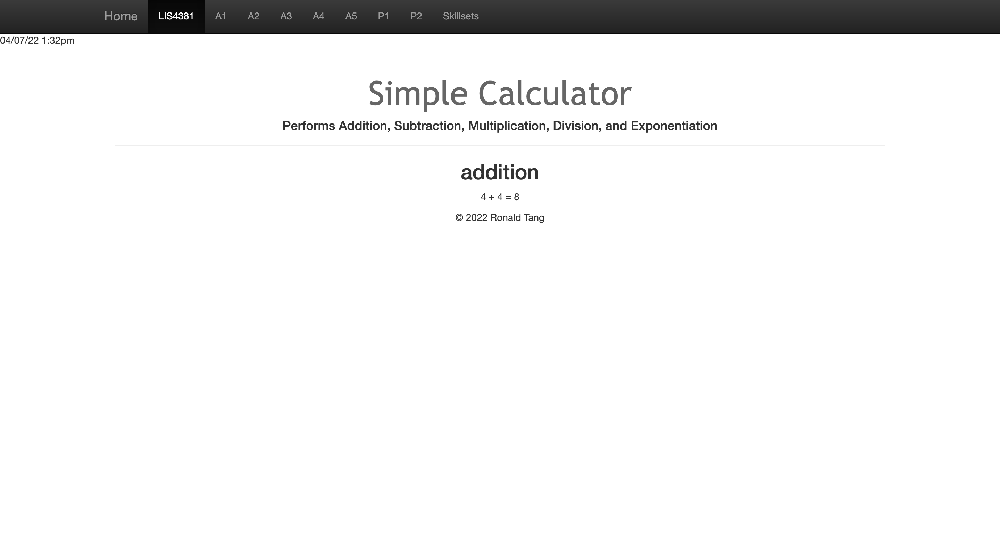
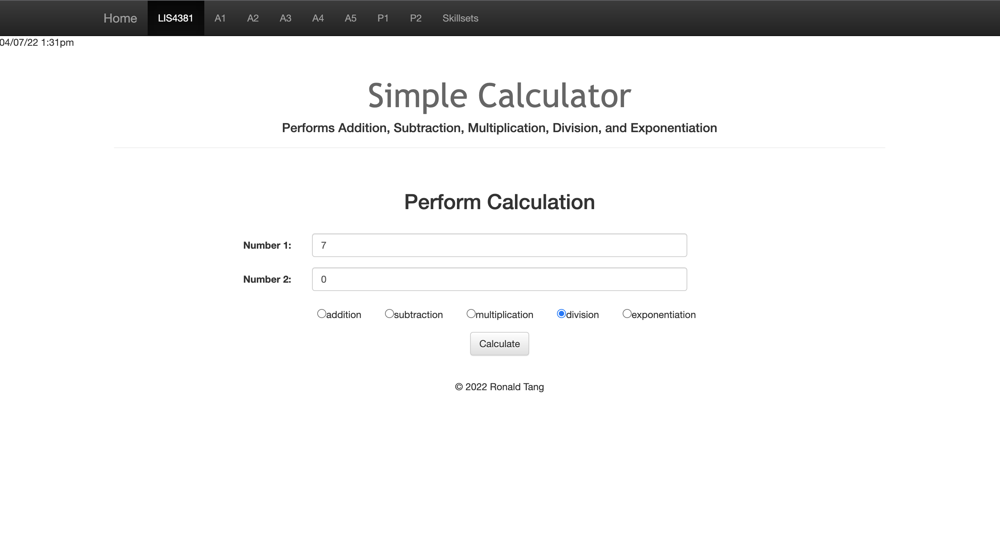
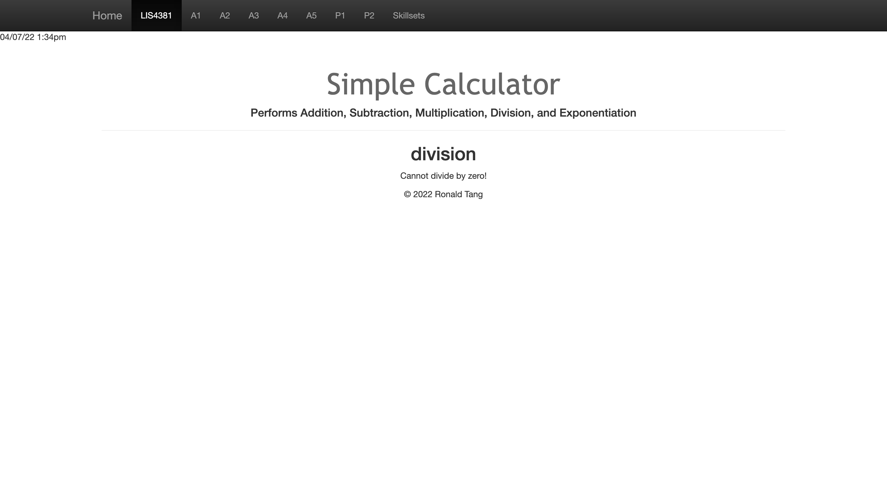
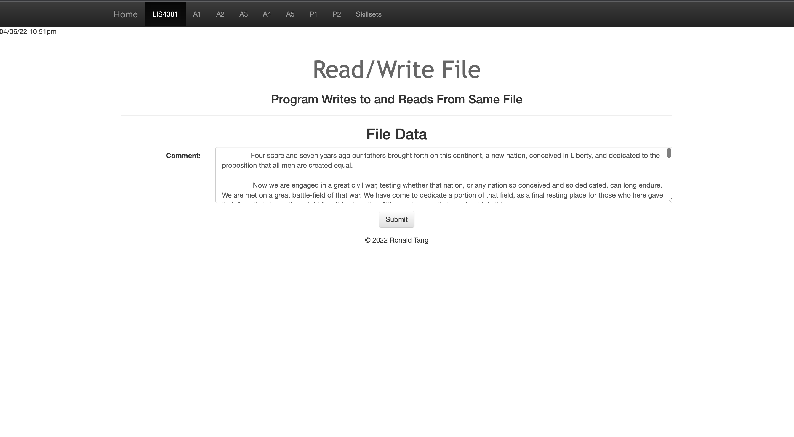
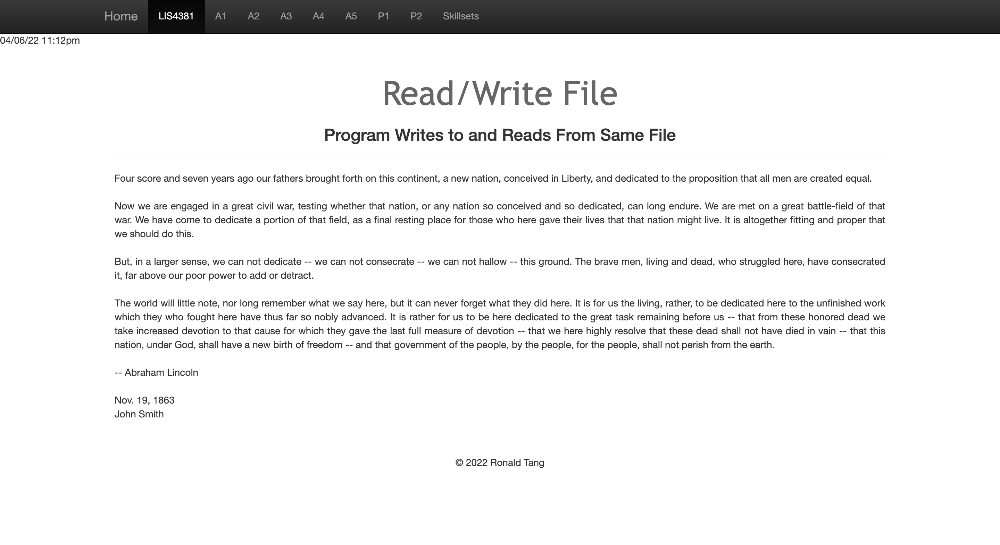

# LIS 4381 - Mobile Web Application Development

## Ronald Tang

### Assignment 5 Requirements:

*Three parts:*

1. Add server-side validation and regular expressions as per the database entity attribute requirements
2. Review other sub-directories and files, and modify them accordingly
3. Provide screenshots of index.php and add_petstore_process.php

#### README.md file should include the following items:

* Screenshots of index.php
* Screenshots of add_petstore_process.php (that includes error.php)
* Screenshot of failed validation
* Screenshot of passed validation
* Screenshot of skillsets

#### Online Portfolio
*Link to local lis4381 web app:*
[Online Portfolio](http://localhost:8080/repos/lis4381/index.php "Online Portfolio")

#### Assignment Screenshots:

*Screenshot of index.php*:

*Screenshot of invalid validation*:

*Screenshot of passed validation*:

*Screenshot of Skillset 13*:

*Screenshot of Simple Calculator*:

| Write/Read File (index.php) | Write/Read file (process.php) |
| ---------- | ---------- |
|  |  |

#### Bitbucket Link:

*My Remote repository:*
[Remote repository](https://bitbucket.org/ronaldtang1/lis4381/ "Remote repository")
