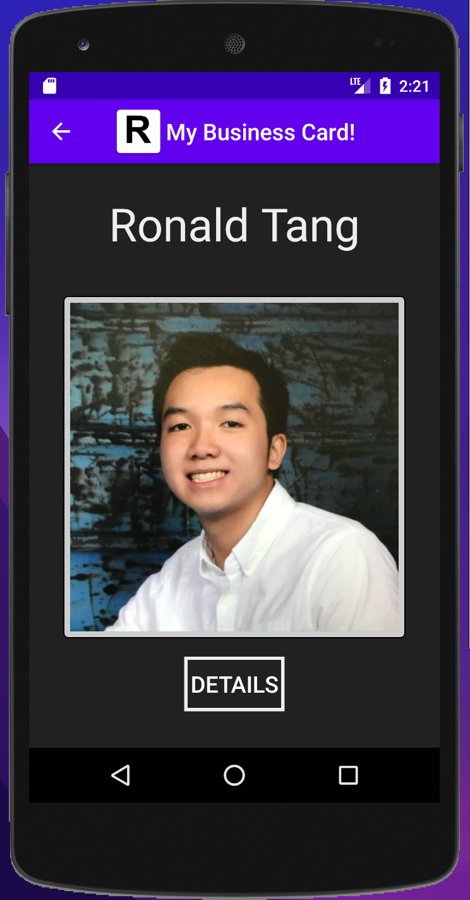
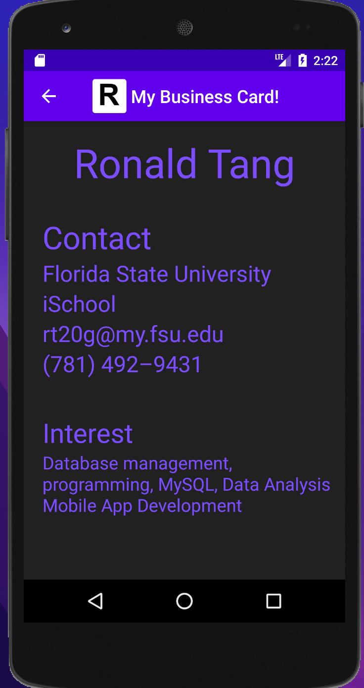
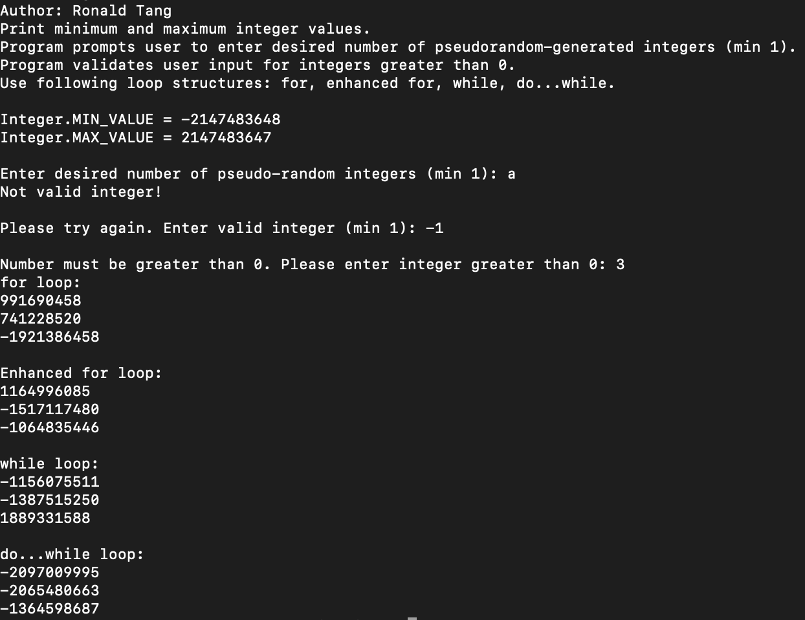
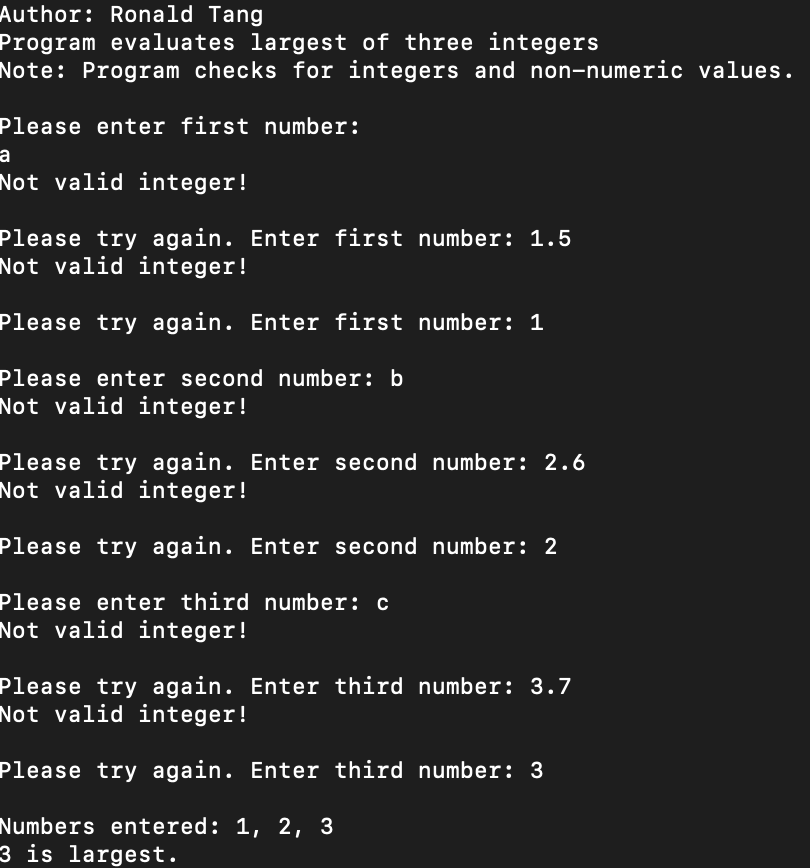
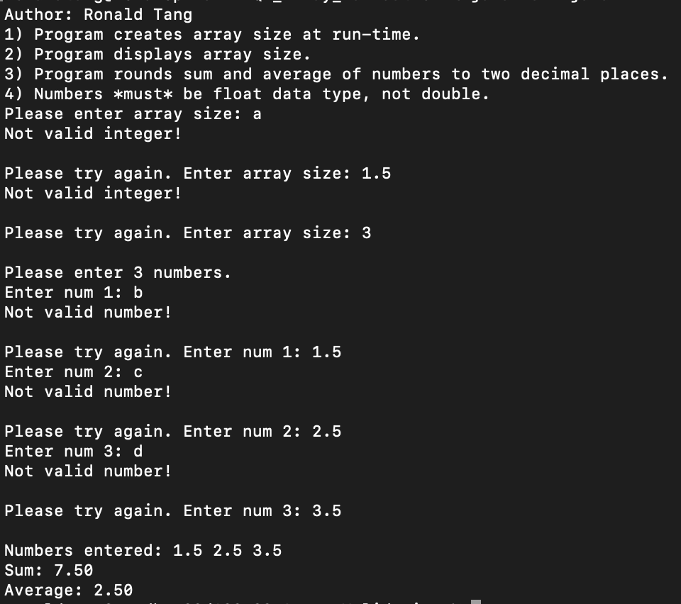

# LIS 4381 - Mobile Web Application Development

## Ronald Tang

### Project 1 Requirements:

*Four parts:*

1. Created My Business Card app
2. Screenshots of runnin application's opening user interface
3. Screenshots of running application's processing user input
4. Screenshots of skillsets

#### README.md file should include the following items:

* Screenshots of running application's opening user interface
* Screenshots of running application's processing user input
* Screenshots of skillsets
* Bitbucket repo link

#### Assignment Screenshots:

| Screenshot of running opening user interface | Screenshot of running user input |
| ---------- | ---------- |
|  |  |

| Skillset 7 | Skillset 8 | Skillset 9 |
| ---------- | ---------- | ----------|
|  |  | 

#### Bitbucket Link:

*Remote repository:*
[Bitbucket Repository Link](https://bitbucket.org/username/myteamquotes/ "My bitbucket repo link")
