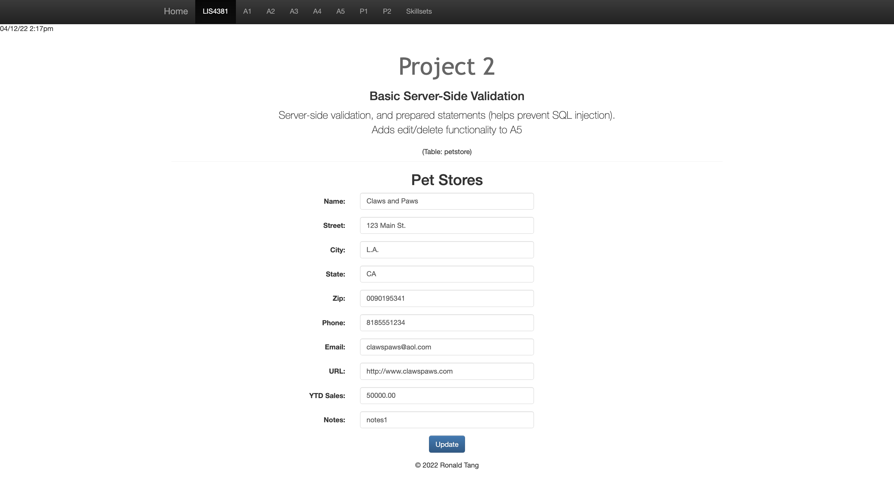

# LIS 4381 - Mobile Web Application Development

## Ronald Tang

### Project 2 Requirements:

*Four parts:*

1. Add edit functionality to the petstore database
2. Add delete functionality to the petstore database
3. Create a RSS feed
4. Chapter Questions (ch. 13 & 14)

#### README.md file should include the following items:

* Course title, Your name, Assignment Requirements
* Screenshot of petstore database running on a browser
* Screenshot of editing a record in the petstore database
* Screenshot of the RSS feed

#### Assignment Screenshots:

*Screenshot of Online Portfolio*:

*Screenshot of Index.php*:

*Screenshot of Edit petstore*:

| Failed Validation | Successful Validation |
| ---------- | ---------- |
|  |  |

| Delete Prompt | Successful Deletion |
| ---------- | ---------- |
|  |  |

*Screenshot of RSS feed*:

#### Bitbucket Link:

*My Remote repository:*
[Remote repository](https://bitbucket.org/ronaldtang1/lis4381/ "Remote repository")
